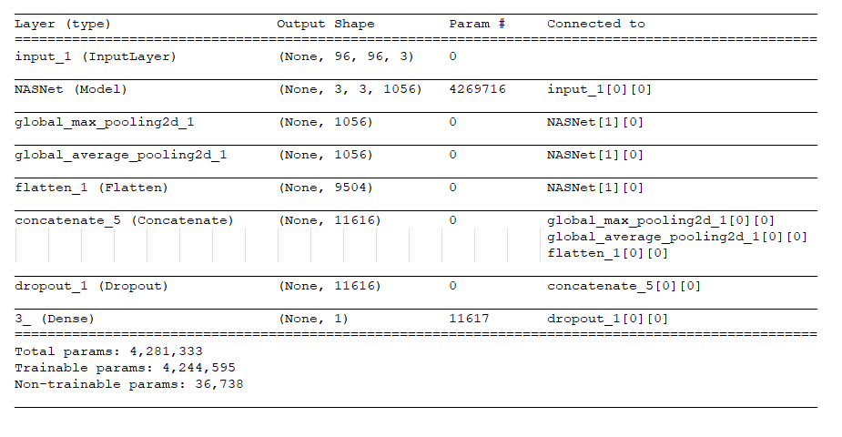

# Histopathologic Cancer Detection

## overview
in the axilla are the first place breast cancer is likely to spread. Metastatic involvement of lymph nodes is one of the most important prognostic factors in breast cancer. Prognosis is poorer when cancer has spread to the lymph nodes. This is why lymph nodes are surgically removed and examined microscopically. However, the diagnostic procedure for pathologists is tedious and time-consuming. But most importantly, small metastases are very difficult to detect and sometimes they are missed.
create an algorithm to identify metastatic cancer in small image patches taken from larger digital pathology scans

## The data
In this dataset, you are provided with a large number of small pathology images to classify. Files are named with an image id. The train_labels.csv file provides the ground truth for the images in the train folder. You are predicting the labels for the images in the test folder. A positive label indicates that the center 32x32px region of a patch contains at least one pixel of tumor tissue. Tumor tissue in the outer region of the patch does not influence the label. This outer region is provided to enable fully-convolutional models that do not use zero-padding, to ensure consistent behavior when applied to a whole-slide image.

The original PCam dataset contains duplicate images due to its probabilistic sampling, however, the version presented on Kaggle does not contain duplicates. We have otherwise maintained the same data and splits as the PCam benchmark.

### Labels
~200K labeled images

~40.5% positive

~59.5 Negative

## Data Preprocessing

The following Augmentation are ran at random on the train set , changing every epoch

Blur

Rotation 

Translation 

Fancy PCA 

Brightness 

Increase Color Saturation 

Motion Blur 

Contrast 

Gauss Noise 

Contrast and Blur 

Contrast and Brightness 

Brightness and Blur 

Brightness and Gauss Noise 

JPEG Compression 

**On top of that the image is cropped at random to exclude some of the edges of the photo**

### Model architecture

### Model hyperparameters exploration

I tried several learning rate and concludeed that ~0.01 is the optimal

We notice that loss decreases nicely over the course of the epoch

The evaluation of the results on the train and validation sets

### Final hyperparameters
After optimizing the hyperparameters I came to the following configuration:
Num classes: 2

Image size (96,96,3)

Batch size: 15000

Validation split 10%

Num epochs: 30

Learning rate: 1e-3

optimizer :SGD

## Results

I can Only evaluate the results on the validation set as the labels for the test set are not released

